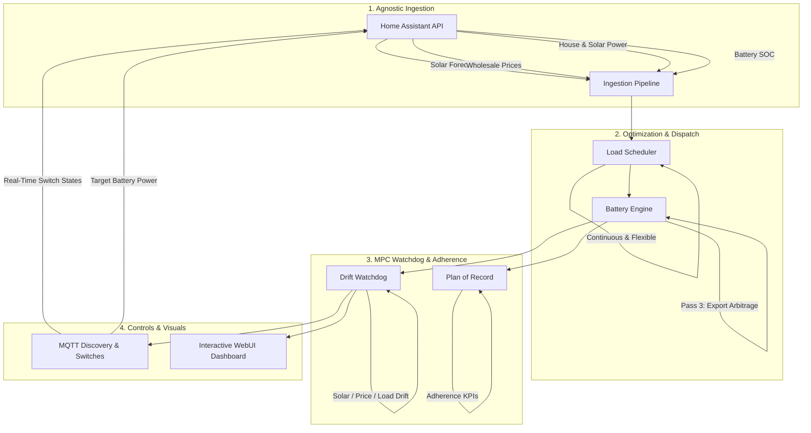

# FluxEM ⚡

[](https://github.com/timberdanlabs/fluxem)
[](https://www.python.org/)
[](LICENSE)
[](https://www.home-assistant.io/)

**FluxEM** is a modern, lightweight, and self-hosted Model Predictive Control (MPC) energy optimization microservice engineered for **[Home Assistant](https://www.home-assistant.io/)**. It delivers predictable, transparent, and intelligent energy dispatch without the heavy solver dependencies, brittle mathematical constraints, or complex YAML overhead of traditional tools.

---

## 🌟 What's New in FluxEM v2.0

- 📅 **Midnight-to-Midnight Calendar Horizon**: Full 24-hour daily timeline (00:00 to 23:59) with dual view modes (**Today** and **Full Multi-Day Forecast**).
- 📍 **Vertical `[ NOW ]` Timeline Indicator**: Real-time glowing indicator across the chart and auto-centering step breakdown table.
- 🎨 **4-Column Grouped Legend with Master Toggles**: Intuitive categorization (Solar, Home Demand, Battery, Deferrable Loads) with single-click master eye toggles (`👁️`) for entire groups.
- 🎯 **Plan of Record & Real-Time Adherence Tracking**: Automatically locks daily morning baseline plans and tracks live adherence KPIs (Actual vs. Planned kWh for Solar, Load, and Battery SOC).
- ⚡ **Real-Time Step-Aligned MQTT Controls**: Real-time virtual switch states (`ON`/`OFF`), battery power setpoints (W), and grid import commands synchronized with the active interval.
- 🔋 **Smart Deficit Pre-Charging Engine**: Proactively detects upcoming peak price jumps and charges the battery from cheap grid power just-in-time, saving hundreds of dollars during volatile wholesale pricing.

---

## 🏗️ Core Architecture & Modules



### Module A: Agnostic Data Ingestion (Bring Your Own Sensors)
- Compatible with any Home Assistant integration: **Solcast, Open-Meteo, Amber Electric, Tibber, Nordpool, Powerpal, Shelly**, and inverter meters.
- Automatic frequency alignment across 5, 15, 30, and 60-minute intervals.
- **Zero-Helper Deferrable Load Decomposition**: Automatically isolates pure baseline household consumption (`Baseline = house_power - sum(deferrable_loads)`) without requiring custom template sensors.

### Module B: Flexible & Critical Deferrable Load Management
- **Critical / Mandatory Appliances (`critical: true`)**: Enforces daily cycle completion for essential thermal/hygiene loads (Hot Water, Heat Pumps), scheduling them across the lowest-cost solar or off-peak periods.
- **Opportunistic / Non-Critical Appliances (`critical: false`)**: Intelligently skips or defers discretionary loads (Pool Pumps, EV Charging) on expensive or overcast days, honoring `max_skip_days`, price ceilings (`max_buy_price`), and `solar_only` constraints.
- **Continuous Unbroken Block Mode (`continuous: true`)**: Guarantees uninterrupted operation for heat pumps and water heaters, anchoring active mid-cycle runs from the current interval.
- **Flexible Cluster Mode (`continuous: false`)**: Optimizes split runs across price dips while enforcing equipment cycle restrictions (`max_starts_per_day`).

### Module C: Smart Deficit Pre-Charging & Battery Arbitrage
- **Deficit Pre-Charging**: Simulates home and appliance energy needs ahead of evening peak prices. If the battery would deplete during high tariffs, it charges the battery from cheap grid power during off-peak or solar valley hours.
- **Dynamic Export Arbitrage (Optional)**: Automatically capitalizes on extreme wholesale feed-in tariff spikes by charging off-peak and exporting when `Efficiency × Sell_Price - Buy_Price - Wear_Cost ≥ Profit_Margin`.

### Module D: Drift-Triggered MPC (Smart Watchdog)
- Compares live telemetry against the active schedule for the current timestep.
- Holds the existing baseline plan when sensors are within configured variance tolerances, re-optimizing only on statistical drift (e.g. sudden cloud cover, spot price spikes, or unexpected load surges).

### Module E: Direct Home Assistant API & MQTT Real-Time Control
- **Zero-YAML Setup**: Connects directly to Home Assistant via Long-Lived Access Token with live entity autocompletion.
- **Historical Load Forecasting**: Analyzes past consumption patterns across a configurable history window (1 to 14 days).
- **Native MQTT Discovery**: Publishes real-time target battery power, grid import setpoints, and virtual switch entities (`switch.fluxem_<appliance_id>`).

---

## 🎨 Interactive Web Dashboard

Access the browser interface at **`http://<FLUXEM_IP>:8000/ui`** (or via Home Assistant Ingress):

- 📈 **Interactive Trajectory Graph**: 24h/multi-day Chart.js visualization with dual Y-axis scaling (Watts on left, Battery SOC % on right).
- 🏷️ **4-Column Grouped Legend**: Interactive visibility toggles with category master controls.
- 📋 **Auto-Centering Breakdown Table**: Displays exact numerical telemetry for each interval, automatically scrolling to center the active `[ NOW ]` interval.
- 🎯 **Adherence Header**: Live KPI meters tracking realized vs. planned solar generation, household demand, and battery SOC adherence.
- ⚙️ **In-App Configuration Modal**: Manage HA entity mappings, battery parameters, appliance constraints, and watchdog thresholds with instant toast feedback.

---

## 🚀 Installation & Quickstart

### 🏠 1. Home Assistant Add-on (Recommended)

1. In Home Assistant, navigate to **Settings ➔ Add-ons ➔ Add-on Store**.
2. Click the **three dots** in the top right ➔ **Repositories**.
3. Add repository URL: `https://github.com/timberdanlabs/fluxem`
4. Find **FluxEM**, click **Install**, and enable **Start on boot**, **Watchdog**, and **Show in sidebar**.
5. Open FluxEM from your sidebar and enter your Home Assistant credentials in the Configuration tab.

---

### 🐳 2. Docker CLI / Container

```bash
docker run -d \
  --name fluxem \
  --restart unless-stopped \
  -p 8000:8000 \
  -v fluxem_data:/app/data \
  ghcr.io/timberdanlabs/fluxem:latest
```

---

### 🐙 3. Docker Compose (`docker-compose.yml`)

```yaml
services:
  fluxem:
    image: ghcr.io/timberdanlabs/fluxem:latest
    container_name: fluxem
    restart: unless-stopped
    ports:
      - "8000:8000"
    volumes:
      - fluxem_data:/app/data

volumes:
  fluxem_data:
```

---

### 🐍 4. Local Development (Virtualenv)

```bash
git clone https://github.com/timberdanlabs/fluxem.git
cd fluxem

python3 -m venv .venv
source .venv/bin/activate
pip install -r requirements.txt

# Run test suite (70 tests)
pytest

# Launch FastAPI microservice
uvicorn fluxem.main:app --host 0.0.0.0 --port 8000 --reload
```

---

## 🤖 Home Assistant Automation Examples

### 1. 30-Minute Battery Grid Pre-Charging Controller
Automate battery grid charging safely using 30-minute hardware timeouts aligned with wholesale market intervals:

```yaml
alias: "FluxEM: 30-Min Battery Grid Pre-Charge Controller"
description: "Checks every 30 minutes if FluxEM requests grid pre-charging and triggers a 30-minute charge block."
mode: restart
trigger:
  - platform: time_pattern
    minutes: "/30"
    seconds: "10"
  - platform: numeric_state
    entity_id: sensor.fluxem_battery_target_power
    above: 500

condition:
  - condition: numeric_state
    entity_id: sensor.fluxem_battery_target_power
    above: 500

action:
  - service: <YOUR_INVERTER_SERVICE_OR_SWITCH>
    data:
      # e.g., duration: 30, power: 5000, or charge switch entity
```

### 2. Regular 30-Minute Sync & Optimization Trigger
```yaml
alias: "FluxEM: Periodic Sync & Optimization"
description: "Triggers FluxEM to ingest live sensor updates every 30 minutes."
mode: single
trigger:
  - platform: time_pattern
    minutes: "/30"
    seconds: "02"
action:
  - service: rest_command.fluxem_sync_and_optimize
```
*Add to `configuration.yaml`:*
```yaml
rest_command:
  fluxem_sync_and_optimize:
    url: "http://<FLUXEM_HOST>:8000/api/v1/ha/sync-and-optimize"
    method: POST
```

---

## 📡 REST API Reference

| Method | Endpoint | Description |
| :--- | :--- | :--- |
| `GET` | `/ui` | Full interactive WebUI dashboard & configuration interface |
| `GET` | `/health` | Microservice health, version, and uptime check |
| `GET` | `/api/v1/ui/dashboard` | Returns active plan, baseline plan of record, adherence KPIs, and telemetry actuals |
| `GET` | `/api/v1/ui/config` | Retrieves active system, battery, and appliance configurations |
| `POST` | `/api/v1/ui/config` | Updates and persists system configuration |
| `POST` | `/api/v1/ha/test-connection` | Validates Home Assistant URL and Access Token connectivity |
| `POST` | `/api/v1/ha/entities` | Live entity autocomplete search from Home Assistant |
| `POST` | `/api/v1/ha/sync-and-optimize` | Pulls live sensor states from Home Assistant and solves optimal MPC dispatch |
| `POST` | `/api/v1/optimize` | Executes raw time-series payload optimization and watchdog evaluation |
| `POST` | `/api/v1/baseline/lock` | Locks the current schedule as the daily Plan of Record baseline |
| `POST` | `/api/v1/baseline/reset` | Clears the active baseline lock |
| `GET` | `/docs` | Interactive OpenAPI Swagger UI documentation |

---

## 📄 License

FluxEM is licensed under the [MIT License](LICENSE). Built with ⚡ for the open-source home energy community.
